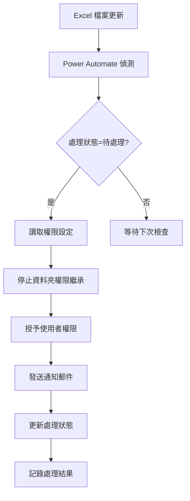

# Power Automate SharePoint 權限設定整合指南

## 概述

Power Automate Premium 提供了一個無需 Azure AD 應用程式註冊的替代方案來設定 SharePoint 資料夾權限。這個方法特別適合有條件式存取原則限制的企業環境。

## 主要特點

- ✅ 不需要 Azure AD 應用程式註冊
- ✅ 使用現有的 Power Automate Premium 授權
- ✅ 透過 Excel 檔案觸發自動化流程
- ✅ 批次處理多個資料夾權限
- ✅ 自動發送通知郵件
- ✅ 詳細的處理狀態追蹤

## 必要條件

1. **Power Automate Premium 授權**
2. **SharePoint 網站存取權限**
3. **能夠建立和執行 Power Automate 流程的權限**
4. **OneDrive 或 SharePoint 來存放觸發用的 Excel 檔案**

## 設定步驟

### 步驟 1：準備檔案

我們提供了以下檔案：

1. **power_automate_sharepoint_permissions.json**
   - Power Automate 流程定義檔
   - 可直接匯入到 Power Automate

2. **power_automate_permissions_trigger.xlsx**
   - 觸發用的 Excel 檔案
   - 包含權限設定表格和使用說明

3. **batch_permissions_import.xlsx**
   - 批次匯入範本
   - 用於大量設定權限

### 步驟 2：匯入 Power Automate 流程

1. 登入 [Power Automate](https://make.powerautomate.com/)
2. 選擇「我的流程」→「匯入」→「匯入套件（舊版）」
3. 上傳 `power_automate_sharepoint_permissions.json`
4. 檢閱匯入設定：
   - 更新連線（Excel Online Business、SharePoint、Office 365）
   - 確認所有連線都使用您的認證

### 步驟 3：設定 Excel 觸發檔案

1. 將 `power_automate_permissions_trigger.xlsx` 上傳到 OneDrive 或 SharePoint
2. 在 OneDrive/SharePoint 中開啟檔案，複製檔案 ID：
   - URL 格式：`https://company.sharepoint.com/.../file.xlsx?id=FILE_ID_HERE`
   - 擷取 `id=` 後面的值

3. 更新 Power Automate 流程：
   - 編輯匯入的流程
   - 找到所有 `EXCEL_FILE_ID` 的地方
   - 替換為您的實際檔案 ID

### 步驟 4：使用流程

#### 方法 1：手動觸發（測試用）

1. 在 Excel 檔案中填入權限設定：
   ```
   審查者名稱: 張三
   資料夾名稱: 張三
   Email: zhangsan@company.com
   權限等級: Contribute
   處理狀態: 待處理
   站台名稱: https://company.sharepoint.com/sites/YourSite
   文件庫: Documents
   ```

2. 儲存 Excel 檔案
3. 在 Power Automate 中手動執行流程
4. 檢查處理結果

#### 方法 2：自動觸發（生產環境）

1. 流程會每 5 分鐘自動檢查一次
2. 當發現「處理狀態」為「待處理」的項目時自動執行
3. 處理完成後會更新狀態為「已處理」或「處理失敗」

### 步驟 5：與 Excel Splitter 整合

在 `excel_splitter_onedrive_fixed.ipynb` 中已整合 Power Automate：

```python
# 處理完所有審查者後
if create_power_automate_file:
    create_power_automate_input_file(
        processed_reviewers,
        output_folder,
        {
            'site': 'https://company.sharepoint.com/sites/YourSite',
            'library': 'Documents'
        }
    )
```

這會自動生成：
- `power_automate_input.xlsx` - 包含所有審查者資訊
- `power_automate_instructions.html` - 詳細設定說明

## 權限等級說明

| 權限等級 | 說明 |
|---------|------|
| Read | 僅可檢視和下載檔案 |
| Contribute | 可檢視、下載、上傳、編輯檔案（建議） |
| Edit | 可檢視、下載、上傳、編輯、刪除檔案 |
| Full Control | 完全控制（請謹慎使用） |

## 流程架構



## 錯誤處理

流程包含完整的錯誤處理機制：

1. **個別失敗不影響整體**
   - 單一資料夾權限設定失敗不會停止整個流程
   - 失敗項目會標記為「處理失敗」並記錄錯誤原因

2. **自動重試機制**
   - API 呼叫失敗時會自動重試
   - 避免暫時性網路問題導致失敗

3. **詳細的錯誤記錄**
   - 所有錯誤都會記錄在 Excel 檔案中
   - 管理員會收到包含錯誤詳情的郵件通知

## 效能考量

1. **批次處理限制**
   - 建議每批次不超過 50 個資料夾
   - 大量資料夾請分批處理

2. **API 速率限制**
   - SharePoint API 有速率限制
   - 流程內建延遲機制避免觸發限制

3. **執行時間**
   - 每個資料夾約需 5-10 秒處理時間
   - 50 個資料夾約需 5-10 分鐘

## 監控和維護

### 監控流程執行

1. 在 Power Automate 中檢視執行歷程
2. 設定失敗通知
3. 定期檢查 Excel 檔案中的處理狀態

### 維護建議

1. **定期清理**
   - 清理已處理的記錄（每月）
   - 歸檔舊的處理記錄

2. **權限審查**
   - 定期審查已授予的權限
   - 移除不再需要的存取權限

3. **流程更新**
   - 關注 Power Automate 更新
   - 測試新功能並優化流程

## 常見問題

### Q1: 為什麼選擇 Power Automate 而不是 PnP PowerShell？

**A:** 在有條件式存取原則的環境中，PnP PowerShell 可能需要 Azure AD 應用程式註冊，而 Power Automate Premium 可以使用現有的使用者認證。

### Q2: 可以同時處理多少個資料夾？

**A:** 技術上沒有硬性限制，但建議每批次 50 個以內，以避免逾時和 API 限制。

### Q3: 如何處理重複的權限設定？

**A:** 如果使用者已有權限，SharePoint API 會更新權限等級而不會產生錯誤。

### Q4: 可以撤銷已授予的權限嗎？

**A:** 是的，可以建立另一個流程來移除權限，或手動在 SharePoint 中管理。

### Q5: 如何確認郵件已發送？

**A:** 檢查 Power Automate 執行歷程，或查看寄件者的「已傳送郵件」資料夾。

## 進階設定

### 自訂郵件範本

編輯流程中的「傳送處理結果通知」動作，可自訂：
- 郵件主旨
- 郵件內容（支援 HTML）
- 收件者（可改為特定管理員）

### 新增核准步驟

可在授予權限前加入核准動作：
1. 新增「核准」動作
2. 設定核准者
3. 等待核准結果
4. 根據結果決定是否授權

### 整合其他系統

Power Automate 支援數百個連接器：
- Teams 通知
- ServiceNow 工單
- SQL 資料庫記錄
- Power BI 報表

## 支援資源

1. [Power Automate 文件](https://docs.microsoft.com/power-automate/)
2. [SharePoint REST API 參考](https://docs.microsoft.com/sharepoint/dev/sp-add-ins/sharepoint-rest-service)
3. [Power Automate 社群](https://powerusers.microsoft.com/t5/Power-Automate-Community/ct-p/FlowCommunity)

## 版本歷程

- v1.0 (2024-01) - 初始版本，支援基本權限設定
- v1.1 (2024-02) - 新增批次處理和錯誤處理
- v1.2 (2024-03) - 整合 Excel Splitter 工具

---

*本指南由 Claude Code 協助生成* 🤖